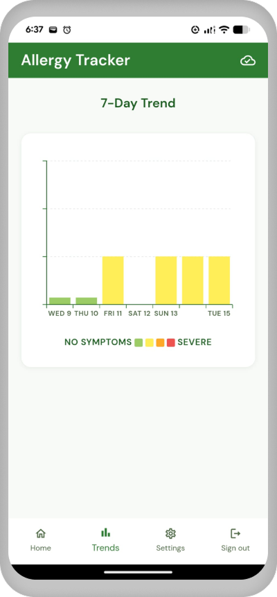
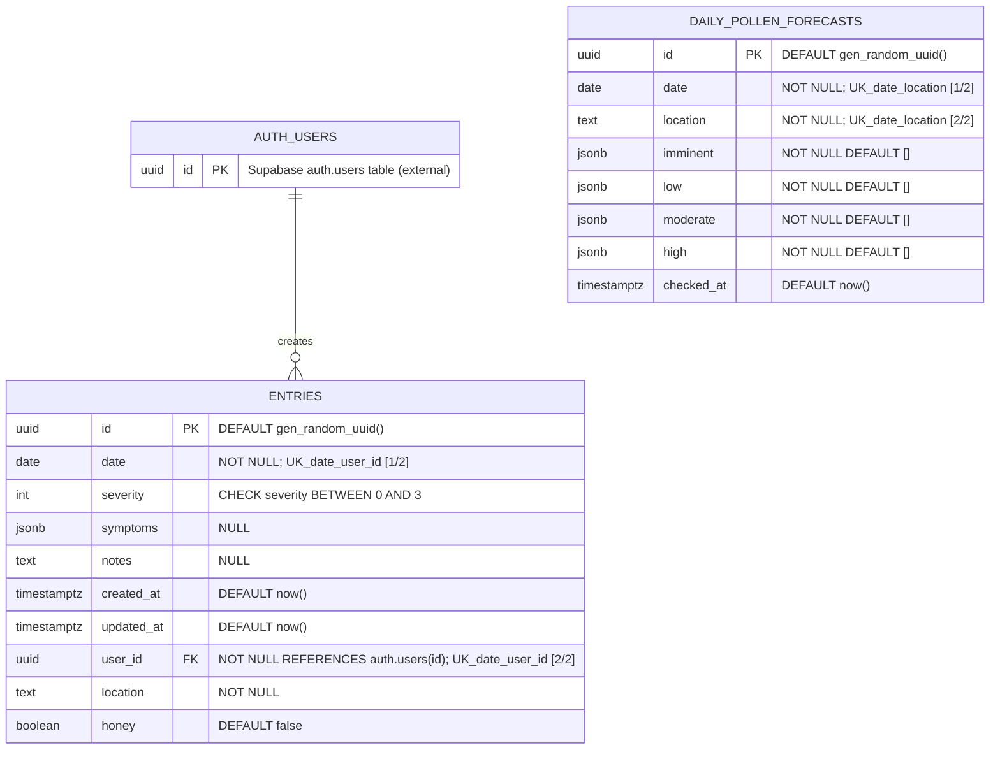

# Allergy Tracker
A New Zealand focused Hay Fever Tracking App that lets you log daily hay fever symptoms in a few taps. 

🔗 **[Live Demo](https://allergy-tracker-q0vb.onrender.com)**

### Features
1. Daily Check-in with optional symptom tags
2. Pollen Forecast pulled from MetService
3. 7-day Trend Chart - work in progress
4. Daily reminder - work in progress
5. Installable PWA - works offline, and all data stays on your device until you're ready to sync

<table>
  <tr>
    <td align="center">
       
      <em>Daily check-in screen</em>
    </td>
    <td align="center">
       
      <em>Log Form screen</em>
    </td>
    <td align="center">
       
      <em>Daily Record screen</em>
    </td>
    <td align="center">
       
      <em>7-day Trend screen</em>
    </td>
  </tr>
</table>

### Potential Further Development
The log data collected could be used to study the personalised pollen-symptom pattern, as well as effectiveness of potential treatments.

### Potential Treatments to Help Relieve Hay Fever Symptoms
1. Local honey
2. Acupuncture

### Environmental Factors That Could Affect Hay Fever
- Pollen type
- Weather: Humidity, Rain, Wind, Temperature

## Tech Stack
- Backend: FastAPI
- Frontend: React + MUI + Tailwind CSS
- Database & Auth: Supabase

## ERD

### Constraint summary

`daily_pollen_forecasts`
- `id` is the primary key.
- `date` is required.
- `location` is required.
- `imminent`, `low`, `moderate`, and `high` are required JSONB fields with default `'[]'::jsonb`.
- `checked_at` defaults to the current timestamp.
- Unique constraint: `(date, location)`.

`entries`
- `id` is the primary key.
- `date` is required.
- `severity` must satisfy `0 <= severity <= 3`.
- `symptoms` and `notes` are optional.
- `created_at` and `updated_at` default to `now()`.
- `user_id` is required and references `auth.users(id)`.
- `location` is required.
- Unique constraint: `(date, user_id)`.

Relationship notes
- Each `entries` row belongs to one `auth.users` record.
- `daily_pollen_forecasts` is a separate read-only public dataset for pollutant forecast data by date and location.