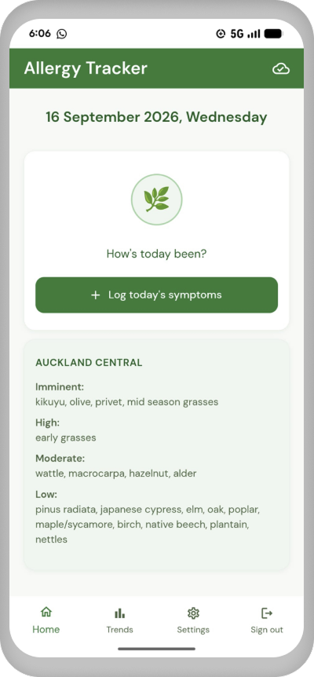
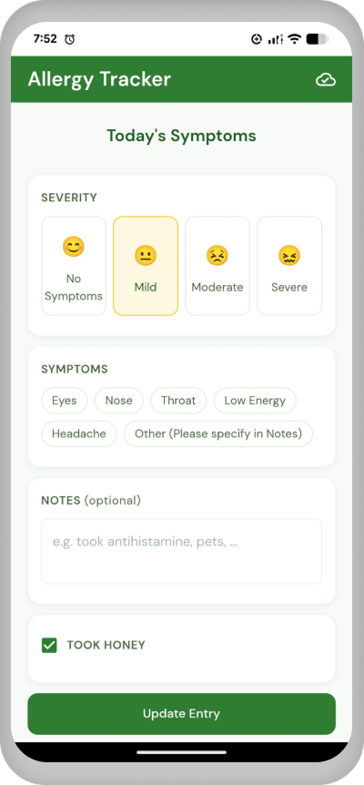
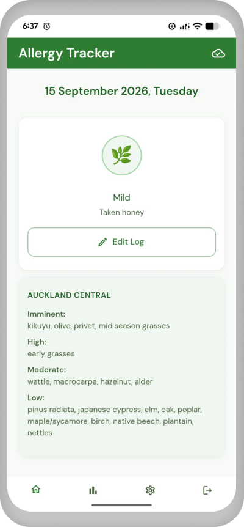
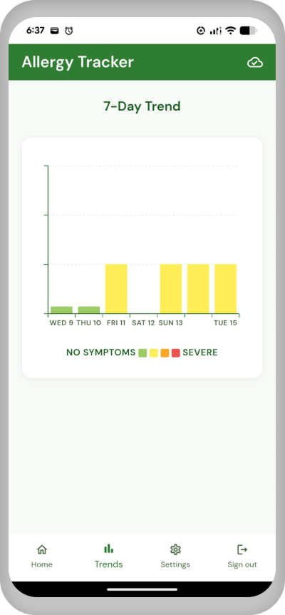
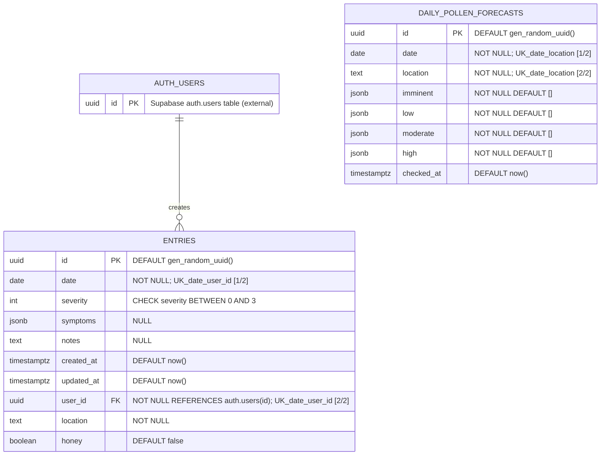

# Allergy Tracker
A New Zealand focused Hay Fever Tracking App that lets you log daily hay fever symptoms in a few taps. 

🔗 **[Live Demo](https://allergy-tracker-q0vb.onrender.com)**

### Features
1. Daily Check-in with optional symptom tags
2. Pollen Forecast pulled from MetService
3. 7-day Trend Chart
4. Daily reminder - work in progress
5. Installable PWA, support offline and sync data when online - work in progress

<table>
  <tr>
    <td align="center">
       
      <em>Daily check-in screen</em>
    </td>
    <td align="center">
       
      <em>Log Form screen</em>
    </td>
    <td align="center">
       
      <em>Daily Record screen</em>
    </td>
    <td align="center">
       
      <em>7-day Trend screen</em>
    </td>
  </tr>
</table>

---
### What I learned
1. Race condition
2. State management
3. Upsert
4. Dexie/ IndexedDB - async, capacity, indexed queries, offline storage

---

## Tech Stack
- **Backend (Server):** FastAPI (Python, Type-Safe)
- **Frontend (Client):** React + TypeScript + Vite + TanStack Query + Zustand + Zod + MUI + MUI X Charts + Tailwind CSS
- **Database & Auth:** Supabase (Managed PostgreSQL)
- **Hosting:** Render

### Architectural Decisions
- **Repository Structure:** Decoupled Client-Server Monorepo.
- **Initial Deployment:** Co-located single-server deployment, serving the compiled React SPA static assets directly through FastAPI to simplify early deployment pipelines on Render.
- **Future Strategy:** Separate client hosting to a static CDN to eliminate Render cold-start latency on initial page loads.

#### FastAPI
  1. Maintains active Python practice while using Pydantic for end-to-end type safety.
  2. Positions the backend for integration with future Python data analysis workflows.
  3. Applies horizontal N-tier architecture (learned from *Full Stack Open*) to ensure clear separation of concerns and simpler testing.
  4. Uses SQLModel ORM for PostgreSQL interactions.
  5. Preserves options to transition into a Feature-Driven N-Tier structure as the codebase grows.

#### Supabase
  1. A managed Postgres instance with the option to migrate to custom cloud infrastructure.
  2. Built-in Auth to manage security and user identity out of the box.

#### React + TypeScript + Frontend Ecosystem
  1. Applies TypeScript, Zod, Zustand, and TanStack Query learned from *Full Stack Open*.
  2. Leverages MUI and MUI X Charts for pre-built UI components and data visualisations.
  3. Uses Tailwind CSS for page layout while relying on MUI for component styling.
     
#### Render
  1. Simplifies early CI/CD by deploying the backend and static SPA together as a single Web Service.
  2. Allows easy decoupling of the frontend to an independent static host when needed.

## ERD

```mermaid
erDiagram
    AUTH_USERS {
        uuid id PK "Supabase auth.users table (external)"
    }

    DAILY_POLLEN_FORECASTS {
        uuid id PK "DEFAULT gen_random_uuid()"
        date date "NOT NULL; UK_date_location [1/2]"
        text location "NOT NULL; UK_date_location [2/2]"
        jsonb imminent "NOT NULL DEFAULT []"
        jsonb low "NOT NULL DEFAULT []"
        jsonb moderate "NOT NULL DEFAULT []"
        jsonb high "NOT NULL DEFAULT []"
        timestamptz checked_at "DEFAULT now()"
    }

    ENTRIES {
        uuid id PK "DEFAULT gen_random_uuid()"
        date date "NOT NULL; UK_date_user_id [1/2]" 
        int severity "CHECK severity BETWEEN 0 AND 3"
        jsonb symptoms "NULL"
        text notes "NULL"
        timestamptz created_at "DEFAULT now()"
        timestamptz updated_at "DEFAULT now()"
        uuid user_id FK "NOT NULL REFERENCES auth.users(id); UK_date_user_id [2/2]"
        text location "NOT NULL"
        boolean honey "DEFAULT false"
    }

    AUTH_USERS ||--o{ ENTRIES : creates
```

### Constraint summary

`daily_pollen_forecasts`
- Unique constraint: `(date, location)`, a location can only have a record a day.

`entries`
- Unique constraint: `(date, user_id)`, a user can only have a single record a day.

Relationship notes
- Each `entries` row belongs to one `auth.users` record.
- `daily_pollen_forecasts` is a separate read-only public dataset for pollen forecast data by date and location.

---

### Potential Further Development
The log data collected could be used to study the personalised pollen-symptom pattern, as well as effectiveness of potential treatments.

### Potential Treatments to Help Relieve Hay Fever Symptoms
1. Local honey
2. Acupuncture

### Environmental Factors That Could Affect Hay Fever
- Pollen type
- Weather: Humidity, Rain, Wind, Temperature
